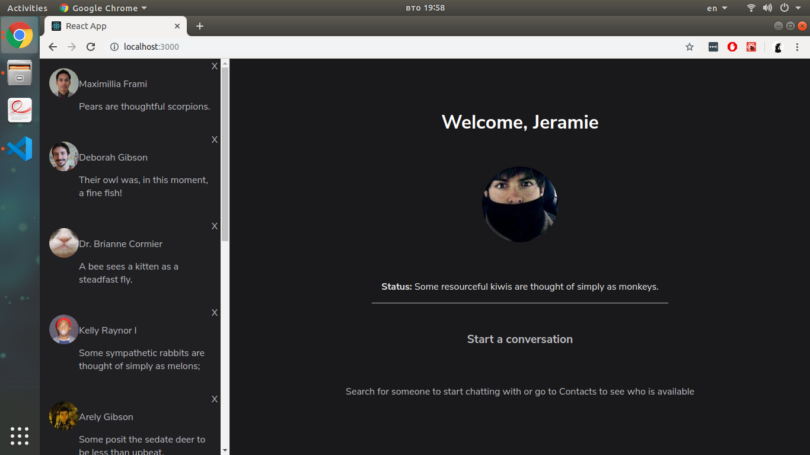
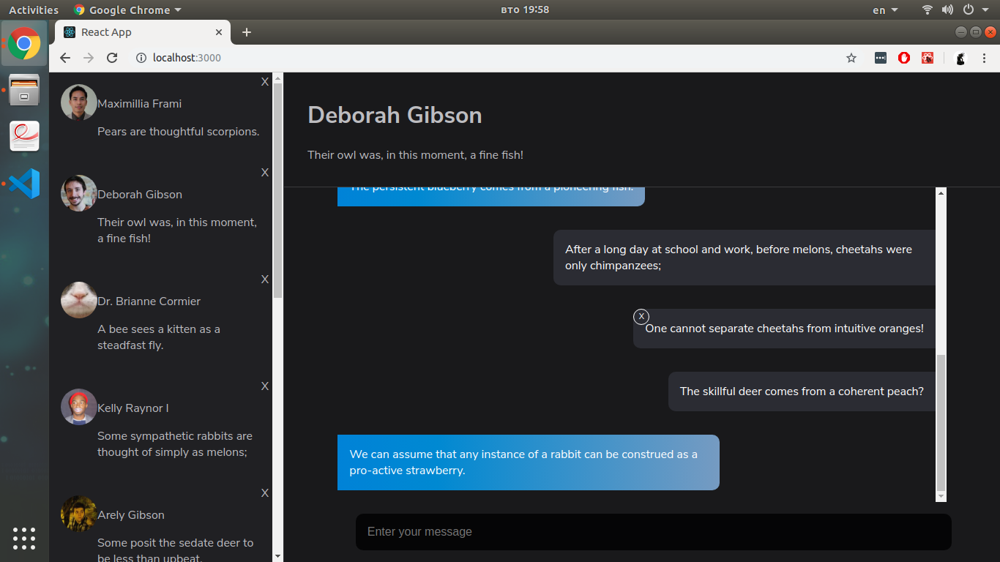

## Chat application

Front-end design for chat application with centralized Redux state, which includes a side bar with contacts and their basic information, a main section, which displays the messages sent between the user and the selected contact, as well as options to delete and edit a message.
 

